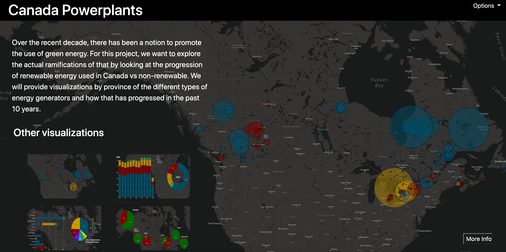

# CANADA - POWER GENERATION AND RENEWABLE ENERGY

#### Team Members: 
- Nazila Entezari
- Ying Feng
- Fariha Siddiqui

Over the recent decade, there has been a notion to promote the use of green energy. For this project, we want to explore the actual ramifications of that by looking at the progression of renewable energy used in Canada vs non-renewable. We will provide visualizations by province of the different types of energy generators and how that has progressed in the past 12 years.

## ETL (Extraction, Transformation & Load)

### Data Sources:

- Statistics Canada - https://www150.statcan.gc.ca/t1/tbl1/en/tv.action?pid=2510001501
- Wikipedia - https://en.wikipedia.org/wiki/List_of_generating_stations_in_Canada#By_Type

### Data Cleaning & Extraction 

- Extracted data using pandas in Python 
- Used geopandas and geopy to get the coordinates for powerplants 
- Changed date format 
- Removed null values 
_ Grouped data based on our requirments

### Webpage 

## Conclusion

- The most important source of energy in Canada is moving water, which generates 59% of electricity supply.

- Fossil fuel including (coal, natural gas and petroleum) is the second most important energy source for electricity generation in Canada. Fossil fuel generation is particularly  significant in Alberta.

- Nuclear power is the third most important source of electricity in Canada. About 16% of electricity is generated in Ontario.
