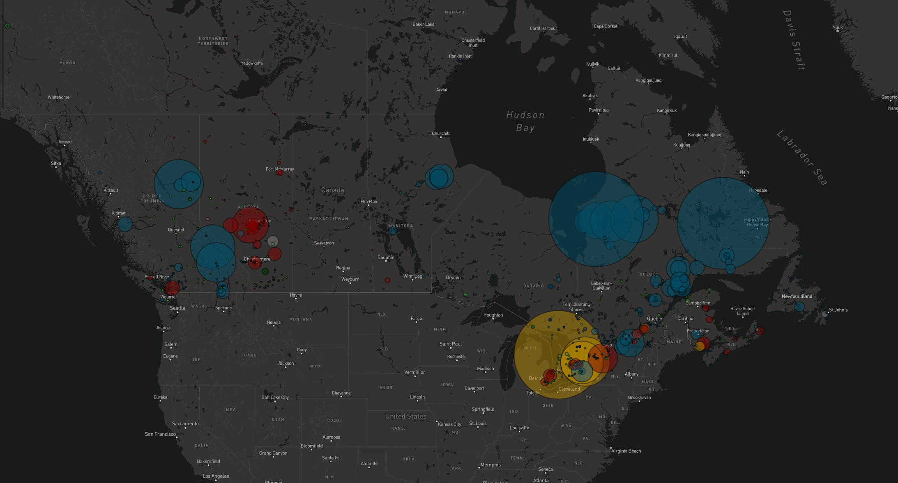
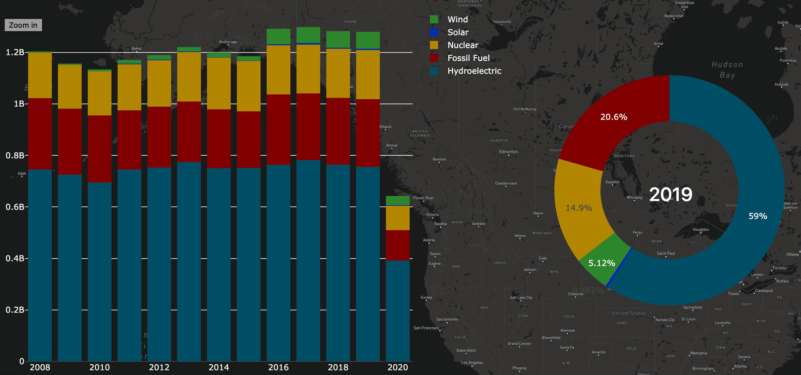
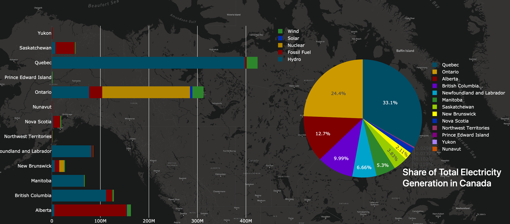
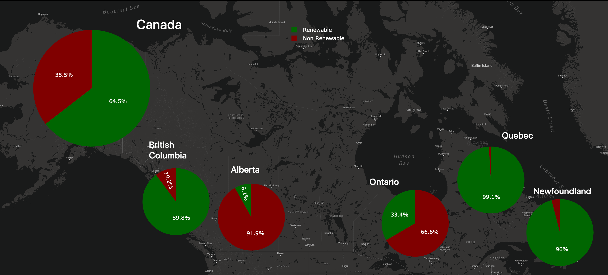

# CANADA - POWER GENERATION AND RENEWABLE ENERGY

#### Team Members: 
- Nazila Entezari
- Ying Feng
- Fariha Siddiqui

## Overview
Over the recent decade, there has been a notion to promote the use of green energy. For this project, we want to explore the actual ramifications of that by looking at the progression of renewable energy used in Canada vs non-renewable. We will provide visualizations by province of the different types of energy generators and how that has progressed in the past 12 years.

## ETL (Extraction, Transformation & Load)

### Data Sources:

- Statistics Canada - https://www150.statcan.gc.ca/t1/tbl1/en/tv.action?pid=2510001501
- Wikipedia - https://en.wikipedia.org/wiki/List_of_generating_stations_in_Canada#By_Type

### Data Cleaning & Extraction 

- Extracted data using pandas in Python 
- Used geopandas and geopy to get the coordinates for powerplants 
- Changed date format 
- Removed null values 
- Grouped data based on our requirments

## Webpage 

## Other visualizations

#### Map showing Powerplant locations across Canada:

##### Analysis:
- In Canada, the major power plants are hydraulic. This capacity has been developed where favourable geography and hydrography exist, primarily in Quebec, but also in British Columbia, Ontario, Labrador and Manitoba and Yukon. Ontario and New Brunswick are home to nuclear power stations. Alberta, Saskatchewan, Nova Scotia  and nothern territories mainly use fossil fuels for their energy source. In Prince Edward Island, wind is the major source of energy. Nunavut energy is based on Petroleum. Solar however small (less than 1%) is being deployed in Ontario.

#### Plots: 
1. Stacked bar chart - Canada's electricity generation in the past 12 years.
   Donut chart - Energy source distribution for 2019. 
   
2. Horizontal stacked bar chart - Enegy source distribution for each province. 
    Pie Chart - Power genration distribution across provinces.
    
3. Renewable vs. non-renewable energy sources.   

##### Analysis:
- Hydro, different Fossil Fuels(including Natural Gas/oil/Coal) and Nuclear remain the major sources of energy during the recent 12 year period. 
Hydro as the major source of renewable has been dominantly taking the biggest share. Wind as a renewable source of energy though has gradually increased its share to around 5% in 2019. Solar as the other source of renewable has had a very slower increase in the 5 recent years.

## Conclusion

- The most important source of energy in Canada is moving water, which generates 59% of electricity supply. Non-hydro renewable sources currently contribute 5.2 per cent of Canada’s electricity supply. Wind has become the predominant non-hydro renewable source surpassing biomass (e.g., wood waste, spent pulping liquor). An emerging source, solar provides a still small but rapidly increasing amount of electricity.

- Fossil fuel including (coal, natural gas and petroleum) is the second most important energy source for electricity generation in Canada. Fossil fuel generation is particularly  significant in Alberta.

- Nuclear power is the third most important source of electricity in Canada. About 16% of electricity is generated in Ontario.
